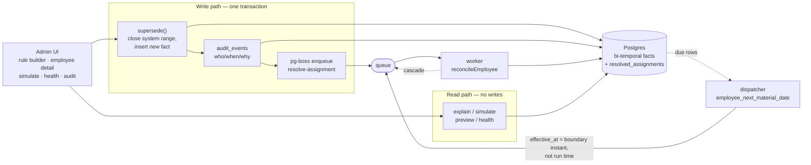
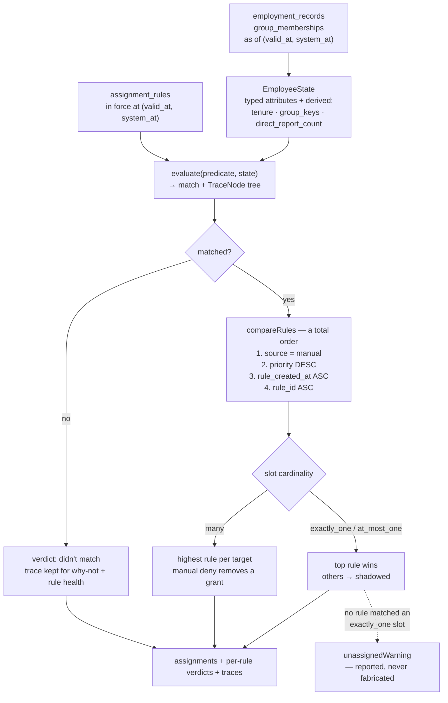
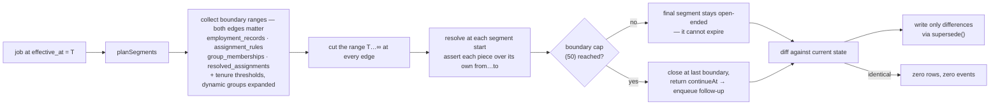
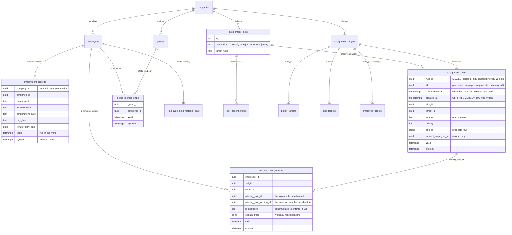

# ARCHITECTURE.md

Policy Assignment System — the design narrative, and the first document to read
after `README.md`. `DECISIONS.md` records each locked call and its rationale;
`NOTES.md` carries the implementation-level detail behind what follows.

## The shape of the system

Everything resolves through one loop:

1. **Facts** live in bi-temporal tables — `employment_records`, `group_memberships`,
   `assignment_rules`, and `resolved_assignments`. Configuration does not:
   slots, slot dependencies, targets and dynamic-group *definitions* are read
   at current knowledge only, so editing a group definition rewrites history's
   interpretation rather than versioning it. That boundary is a real gap, not a
   deliberate simplification. Each carries `valid` (when it was true in the world) and
   `system` (when we believed it). There is exactly one mutation, `supersede()`:
   close the affected rows' system ranges, reinsert any valid-range remnants the
   new assertion doesn't cover, insert the new fact. `valid` is never edited.
2. **Rules** compile from one predicate DSL two ways: `evaluate()` produces a
   per-node match plus a trace tree for explanations; `toSql()` produces a
   parameterized `WHERE` fragment for reverse matching ("which employees does
   this rule hit?"). A property test asserts the two agree.
3. **Resolution** is a pure function: `resolveEmployee(slots, rules, state, asOf)`
   → assignments + per-rule verdicts + explain traces. Slot cardinality lives on
   the slot; a manual override is just a rule with `source='manual'` and a
   subject, and it wins because the comparator puts `source` before `priority`.
4. **Reconciliation** is level-triggered and segmented. A job at `effectiveAt = T`
   claims what is true *at T* — so `planSegments` cuts `[T, ∞)` at every known
   boundary (both edges of open fact/rule/membership/published ranges, plus
   tenure thresholds found by expanding dynamic groups), resolves at each
   segment start, and asserts each piece over its own `[from, to)`. The last
   segment is open-ended when nothing is known to change after it; if the
   boundary cap truncates, the plan returns `continueAt` and the worker enqueues
   a follow-up job there. Only differences are written.
5. **Scheduling** is per-employee `employee_next_material_date`: the earliest
   instant any predicate could flip, recomputed inside every write and every
   reconcile. A dispatcher turns due rows into `resolve-assignment` jobs at the
   exact boundary instant — effective time is separate from processing time.
6. **Effects on the world** (provisioning) are out of scope by design; the
   engine decides *what* should be true, auditably.

### Resolving one employee

Resolution is a pure function. The same function backs reconciliation, simulate,
and the rule preview — a dry run that could disagree with the save would be worse
than no dry run.

Every term in the comparator is stable across versions of the same rule. That is
the constraint, not a detail of it: resolution for a past date must be a function
of the facts and rules in force on that date and nothing else.

### Reconciling over time

A job carrying `effectiveAt = T` knows only what is true *at T*. It must not
assert over `[T, ∞)`, because it knows nothing about the far side of a boundary
it can already see.

Reconciliation is **level-triggered**: the worker rebuilds desired state from
source facts and diffs it, rather than applying event deltas. Duplicated,
out-of-order, and replayed jobs are therefore all harmless — an event means
"this employee is dirty", nothing more.

When a rule changes we do not sweep the company. The candidate set is the union
of employees matching the **old** criteria, employees matching the **new**
criteria, and employees whose currently-open assignment names the changed rule.
Dropping the first set is the classic bug; it leaves behind exactly the people
who *stopped* matching.

### The data model

Four tables carry facts, and all four are bi-temporal: `valid` (when the fact was
true in the world) and `system` (when we believed it). GiST exclusion constraints
enforce non-overlap on **both** axes, including inside historical belief states.

**`assignment_rules` carries two identities, and the difference is load-bearing.**
`rule_id` is the logical rule an admin authors, renames and edits; `id` is a
per-version surrogate the write path regenerates every time a rule is superseded
or its valid range is sliced. The tie-break may only read terms that are stable
across versions, so it reads `rule_id` and `rule_created_at` — never `id` or
`created_at`. Migration 003 introduced this split to fix the write primitive, and
in doing so silently broke the ordering; migration 004 is the repair, and the
rule it lands on is that *a tie-break may only read columns that are stable by
construction across versions*. `resolved_assignments` keeps both: `winning_rule_id`
so an admin sees the rule they recognise, `winning_rule_version_id` so an old
explain trace stays reproducible after that rule has been edited.

Two further details in that diagram carry weight. `assignment_targets` is one canonical
registry with typed subtypes, because the brief lists **manager** as an
assignment — a schema hardcoding `policy_id` cannot represent it without a
special case, so `employment_records` deliberately has no `manager_id` column and
reporting lines resolve through the `manager` slot like everything else.
And `resolved_assignments` denormalizes `is_exclusive` so that "at most one
target per exclusive slot" is a database exclusion constraint rather than a
promise the resolver makes.

## The UX surface

- **Employee detail** answers both questions: "why does X have Y" (per-slot
  verdicts grouped by applied / denied / shadowed / didn't-match, each with a
  sentence) and "why *doesn't* X have Y" (a why-not panel per slot listing the
  targets a grant rule could have assigned and the condition that failed).
  Unassigned `exactly_one` slots get a banner — the resolver reports that
  rather than fabricating an assignment to satisfy a declaration.
- **A timeline** draws one band per slot, assignment segments over their valid
  ranges, concurrent segments stacked so nothing hides. The system-time control
  in the header redraws the whole picture under an older belief; the valid-time
  marker is draggable.
- **Rule health** aggregates the verdicts the engine already produces: dead
  rules, always-shadowed rules, equal-priority collisions, and unfilled
  required slots — split into *uncovered* (write a rule) and *explicitly
  denied* (confirm the override is intended), because those need different
  actions.
- **Simulation and preview** share `resolveEmployee` and `diffAssignments` with
  reconciliation itself — a dry run that could disagree with the save would be
  worse than no dry run.

## What we noticed

The brief describes what to build; anyone who finished it built roughly this
engine. These are the things the brief did not mention that the problem turned
out to demand.

1. **Nobody deletes rules.** They pile up, authors leave, and eventually nobody
   can say which of the forty rules in a slot still do anything. The engine
   knew the answer all along — it computes a verdict for every rule on every
   pass and throws them away. The health panel is just those verdicts kept.

2. **The real ticket is the inverse of the brief's.** "Why does Jane have X"
   is rare; "Jane should have X, why doesn't she" is daily. The trace already
   contains the failing condition for every rule that failed. Explaining a
   failure correctly means blaming only the responsible branches — the failing
   side of an `and`, every branch of an `or` — and handling negation as
   polarity, not string surgery. An early version of the explainer rendered a
   *satisfied* `NOT contractors` rule as "applies to everyone" because the leaf
   under it had `matched: false`. The fix was to track whether a leaf sits
   under an odd number of negations, independently of whether it matched.

3. **The bugs that survived review were never inside a component.** They lived
   in the seams between correct pieces: the comparator ordered `priority`
   before `source`, so "manual overrides always win" depended on a numeric
   convention the API default quietly broke; a tenure threshold sat one level
   down inside a dynamic group's predicate, invisible to scheduling; boundary
   collection accepted `Date[]` when it needed ranges, so a revoked
   membership's *end* cut nothing; a two-year horizon silently expired live
   assignments; a module-scoped singleton let a dev-server recompile open a
   second embedded Postgres on the same data directory and corrupt it. The fix
   each time was the same move — make the wrong state unrepresentable rather
   than the right one memorable: `Range[]` sources, ordering position instead
   of a priority ceiling, `rule_created_at` stored per version instead of
   regenerated, `continueAt` returned so a caller cannot drop it without
   visibly ignoring a value, `globalThis` so "one instance" means one.

4. **A dry run that can disagree with the save is worse than no dry run.** If
   simulate used a different code path than reconcile, the demo would be
   proving a lie. Everything that answers "what would happen" runs the
   production resolver, and a test asserts the simulated outcome equals the
   reconciled one.

5. **A green suite is not evidence.** Four separate times, a defect survived
   the tests and was reproduced by review in minutes — because each fixture
   only exercised the shape its author had already thought of. The pattern only
   broke when the reproductions came from a different head: out-of-order job
   arrival tested at the reconcile layer rather than the segment layer, a
   revoked membership instead of an added one, a satisfied exclusion instead of
   a failing one. The suite now includes those cases, but the honest lesson is
   that the tests you write protect you against the bugs you can already
   imagine.

## Tradeoffs

- **`exactly_one` is reported, not enforced.** A slot declared required can
  genuinely have no matching rule; the resolver emits `unassignedWarning`
  rather than inventing a target. The database enforces *at most one* via
  exclusion constraints on `is_exclusive`; "at least one" is a business claim
  and is surfaced, not asserted.
- **No specificity scoring.** Equal-priority collisions resolve by stable
  tie-break and are *reported* to the admin as collisions ("set distinct
  priorities") rather than silently resolved by AST complexity — which is not
  business specificity and produces explanations nobody can predict.
- **Dynamic groups can't reference groups.** Removes recursion by construction
  and costs no expressiveness (`or` over the underlying criteria). It also made
  single-pass expansion for scheduling safe.
- **Materialization horizon is by boundary count, not time.** An open final
  segment is the common case; a 25-year tenure threshold is two segments, not
  a liability.
- **Embedded PGlite vs real Postgres.** PGlite runs the full engine with real
  `tstzrange`/GiST semantics for tests and demo; the worker/pg-boss path is
  the production topology.

## Future directions

- **Resolver as an MCP server**, so an internal assistant answers "why does
  Jane have X as of March" against the engine itself rather than a summary.
- **Provisioning sagas** (Temporal or equivalent) for the outbound side —
  pushing the resolved set into GitHub/Slack/carriers. The engine decides what
  should be true; provisioning is a separate, sagas-shaped problem.
- **Population-level simulation**: "if we change the CA rule, who gains or
  loses what across all employees." Reverse matching and the diff helper
  already exist; this is the natural extension of the rule preview.
- **History partitioning** by company, and the harder question of migrating
  rule semantics under years of dependent history.

## Limitations

Stated plainly rather than discovered:

- **Company setup is developer-steps only.** Seeding creates the demo company;
  there is no admin-facing onboarding flow for a new tenant.
- **No onboarding wizard.** New-hire preview exists (simulate a hypothetical
  hire without writing rows); a guided wizard does not.
- **Existing-rule editing is API-only.** `PATCH /api/rules/[id]` is implemented
  and versioned correctly through `supersede`; the structured builder does not
  yet load an existing rule for edit.
- **Performance at scale is unverified.** The suite exercises the seeded
  population (3 employees); `buildEmployeeStates` is batched and candidate
  selection uses compiled SQL, but no population-scale benchmark exists.
- **Real Postgres/worker integration is exercised by code path, not by a
  running deployment** — the pg-boss worker and `withTransaction` adapters are
  written and unit-tested against PGlite, but this environment had no Docker
  daemon for a live Postgres run.
- **Browser journey verified by HTTP smoke and manual click-through**, not an
  automated browser suite.

### Known convergence defects

An independent review reproduced these against this commit. They are listed with
their reproductions rather than left to be discovered, because each one narrows a
guarantee stated elsewhere in this document.

- **Candidate selection conflates the two clocks.** `candidatesForRuleChange`
  passes the effective date as the system time, so a rule written today for a
  past date selects employees using *what was known then* rather than what is
  known now. A department correction learned after the rule's effective date
  therefore leaves the employee out of the candidate set.
- **A new rule schedules only employees who already match.** Creating a
  two-year tenure rule for a one-year employee writes no
  `employee_next_material_date` row and queues no job, so nothing fires at that
  employee's anniversary. Scheduling must consider employees who will match
  later, not only those who match now.
- **Segmentation collects one tenure boundary per rule.** A predicate with both
  a lower and an upper tenure bound (`tenure >= 1 AND NOT tenure >= 2`)
  publishes an open-ended segment where it should close at the second
  threshold. Boundaries need to be discovered per segment, not once per rule.
- **Manager cascades lose their effective dates.** Dependent managers are
  enqueued at the originating job's effective date, and boundary collection
  sees a manager's own assignments but not inbound reporting changes. After a
  future-dated transfer the old manager keeps manager-only training and the new
  one never gains it. A topological sort over slots cannot express a dependency
  that runs between employees.
- **A partial record edit replaces the whole future timeline.** `PATCH` builds
  a full snapshot from the record in force at the effective date and supersedes
  everything after it, so patching location in April silently discards a
  department transfer already scheduled for June. The correction semantics need
  to be stated and then either preserved field-wise or previewed.
- **A second manual override can succeed without taking effect.** The override
  form always writes priority 100, and the comparator prefers the older logical
  rule on a tie, so a later override loses to an earlier one. Replacement needs
  to be an explicit action rather than another insert.
- **Stored provenance can go stale.** Reconciliation compares the winning
  *logical* rule and coverage, not the winning rule *version*, so editing a rule
  without changing its target leaves the previous version id and its explain
  trace attached to the assignment.
- **Preview omits the dependency closure.** Rule preview resolves before and
  after with the same stored `direct_report_count`, so changing a report's
  manager previews only that change and not the manager-training consequences
  the save will produce. Sharing the leaf resolver is necessary for preview and
  save to agree; it is not sufficient.
- **SQL tenure comparison is session-timezone dependent.** `date + interval`
  yields a timestamp without time zone, compared against a `timestamptz`
  boundary that JavaScript builds at UTC midnight. The property test pins the
  session to UTC and so does not cover the discrepancy.

The first four are the substantive ones: they are all instances of the same
mistake, which is deciding *which* employees and *which* time ranges are
affected using information that is narrower than what the system already knows.
The engine's per-employee resolution is not implicated — resolution given a
correct state and a correct instant is exercised by the suite. What is wrong is
the selection of states and instants around it.

## Deliberately not built

An arbitrary predicate-AST editor (the DSL is intentionally restricted to
operators that compile to both evaluators), a full onboarding wizard, and
existing-rule editing in the UI (`PATCH /api/rules/[id]` is API-only — labeled
design-only rather than half-wired). Also: no AI anywhere near resolution — it
only proposes draft predicates at authoring time, schema-validated and
confirmed by a human.
